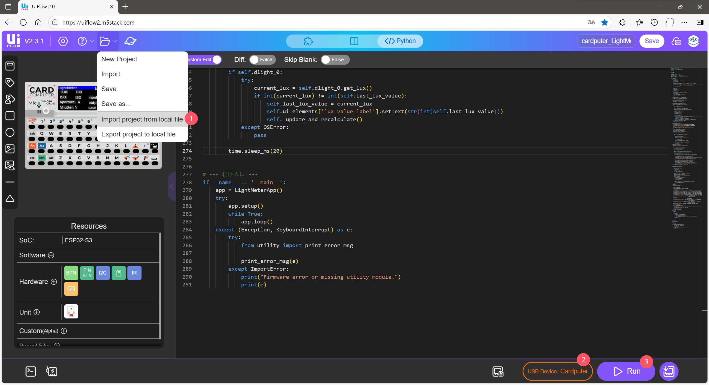

# Cardputer Photography Light Meter

[English](#english) | [中文](#中文)

---

## 📷 Cardputer Photography Light Meter (English)

A feature-rich photography light meter application for the M5Stack Cardputer, developed in MicroPython. It provides both Aperture Priority and Shutter Priority modes with a responsive and intuitive user interface.

 
 
<!-- TODO: Replace this with your own app screenshot -->

### Hardware Requirements

*   M5Stack Cardputer
*   M5Stack DLight Unit (I2C Ambient Light Sensor)

### Features

-   **Dual-Mode Metering**: Supports Aperture Priority (`A`) and Shutter Priority (`S`) modes to suit different shooting scenarios.
-   **Real-Time Calculation**: After adjusting any exposure parameter (ISO, Aperture, Shutter), the third parameter is calculated and updated instantly without any confirmation needed.
-   **Intuitive UI**:
    *   The left side clearly displays the final exposure combination of ISO, Aperture (`APERT`), and Shutter Speed (`SPEED`).
    *   The right side features a vertical selection list for the currently adjustable parameter, providing clear context.
    *   The currently focused parameter and the selected value in the list are highlighted in **green** for clear operational focus.
-   **Smart Boundary Detection**:
    *   When an option in the selection list would cause the calculated result to exceed the preset range (e.g., a shutter speed faster than 1/4000s), that option is marked in **red**.
    *   The application **prevents** the user from selecting red-marked invalid options, ensuring operations stay within a valid exposure range.
-   **Non-Circular Selection**: The parameter list stops scrolling when it reaches the maximum or minimum value, which is more precise and aligns with professional habits.
-   **Hardware Info**: Displays the real-time LUX value from the DLight sensor and the device's battery level.

### How to Use

#### Key Controls

-   **`i` / `a` / `s` keys**: Switch operational focus and metering mode.
    -   **`a` key**: Sets to **Aperture Priority** mode and moves focus to Aperture (`APERT`).
    -   **`s` key**: Sets to **Shutter Priority** mode and moves focus to Shutter Speed (`SPEED`).
    -   **`i` key**: Moves focus to ISO. This action **does not** change the current metering mode (A/S).
-   **`.` key (Up Arrow)**: Scrolls up and selects a value for the focused parameter.
-   **`;` key (Down Arrow)**: Scrolls down and selects a value for the focused parameter.

### Installation (UIFlow2.0)

This project is developed for deployment using **UIFlow2.0**.

1.  **Burn Firmware**: First, use **M5Burner** to burn the latest UIFlow2.0 firmware onto your Cardputer.
2.  **Connect Device**: Press and hold the **G0** button while connecting your Cardputer to your computer via a USB-C cable to enter download mode.
3.  **Open UIFlow2.0**: Launch the UIFlow2.0 IDE (either the web version at [flow.m5stack.com](https://uiflow2.m5stack.com/)).
4.  **Select Device**: In the IDE, select "Cardputer" as your device and establish a connection via the correct COM port.
5.  **Load Project**:
    *   Download the `.m5f2` project file from this repository to your computer.
    *   In the UIFlow2.0 IDE, click on the "Open..." menu option (the folder icon).
    *   Select the downloaded `.m5f2` file to import the entire project.
6.  **Deploy**: Click the **Run** button (the icon with a "play" triangle) to automatically download and execute the program on your Cardputer.
    

---

## 📷 Cardputer 摄影测光表 (中文)

这是一款为 M5Stack Cardputer 打造的功能完善的摄影测光表应用，使用 MicroPython 开发。它提供了光圈优先和快门优先两种核心测光模式，并拥有一个响应迅速、交互直观的用户界面。

### 硬件需求

*   M5Stack Cardputer
*   M5Stack DLight Unit (I2C 环境光传感器)

### 功能特性

-   **双模式测光**: 支持光圈优先 (`A`) 和快门优先 (`S`) 模式，满足不同拍摄场景的需求。
-   **实时计算**: 调整任何曝光参数（ISO、光圈、快门）后，程序会立即计算出第三个参数的值，无需等待或确认。
-   **直观的用户界面**:
    *   左侧清晰显示 ISO、光圈 (`APERT`) 和快门速度 (`SPEED`) 的最终曝光组合。
    *   右侧为当前可调参数的纵向选择列表，提供清晰的上下文。
    *   当前拥有输入焦点的参数和在列表中选中的值，均以**绿色**高亮显示，操作目标明确。
-   **智能边界检测**:
    *   当待选列表中的某个选项会导致计算结果超出预设范围时（例如，计算出的快门速度快于 1/4000s），该选项会在列表中被标为**红色**。
    *   程序会**阻止**用户选择被标为红色的无效选项，确保操作始终在有效曝光组合内。
-   **非循环选择**: 参数列表在选择到最大或最小值后会停止滚动，操作更精确、更符合专业习惯。
-   **硬件信息显示**: 实时显示 DLight 传感器读取的 LUX 值和设备电量。

### 如何使用

#### 按键控制

-   **`i` / `a` / `s` 键**: 切换操作焦点和测光模式。
    -   **`a` 键**: 设定为 **光圈优先** 模式，并将操作焦点切换到光圈 (`APERT`)。
    -   **`s` 键**: 设定为 **快门优先** 模式，并将操作焦点切换到快门速度 (`SPEED`)。
    -   **`i` 键**: 将操作焦点切换到 ISO。此操作**不会**改变当前的测光模式（光圈/快门优先）。
-   **`.` 键 (上箭头)**: 向上滚动并选择当前焦点参数的值。
-   **`;` 键 (下箭头)**: 向下滚动并选择当前焦点参数的值。

### 安装与部署 (UIFlow2.0)

本项目使用 **UIFlow2.0** 进行开发和部署。

1.  **烧录固件**: 首先，使用 **M5Burner** 工具为您的 Cardputer 烧录最新的 UIFlow2.0 固件。
2.  **连接设备**: 按住 **G0** 键的同时，使用 USB-C 数据线将您的 Cardputer 连接到电脑，使其进入下载模式。
3.  **打开 UIFlow2.0**: 启动 UIFlow2.0 IDE (可以是网页版 [flow.m5stack.com](https://uiflow2.m5stack.com/))。
4.  **选择设备**: 在 IDE 中，选择 "Cardputer" 作为您的设备，并通过正确的 COM 端口建立连接。
5.  **加载项目**:
    *   从本代码库下载 `.m5f2` 项目文件到您的电脑。
    *   在 UIFlow2.0 IDE 中，点击“打开...”菜单选项（文件夹图标）。
    *   选择已下载的 `.m5f2` 文件以导入整个项目。
6.  **部署**: 点击 **运行** 按钮 (图标为“播放”三角形)，程序将会自动下载并到您的 Cardputer 上执行。
