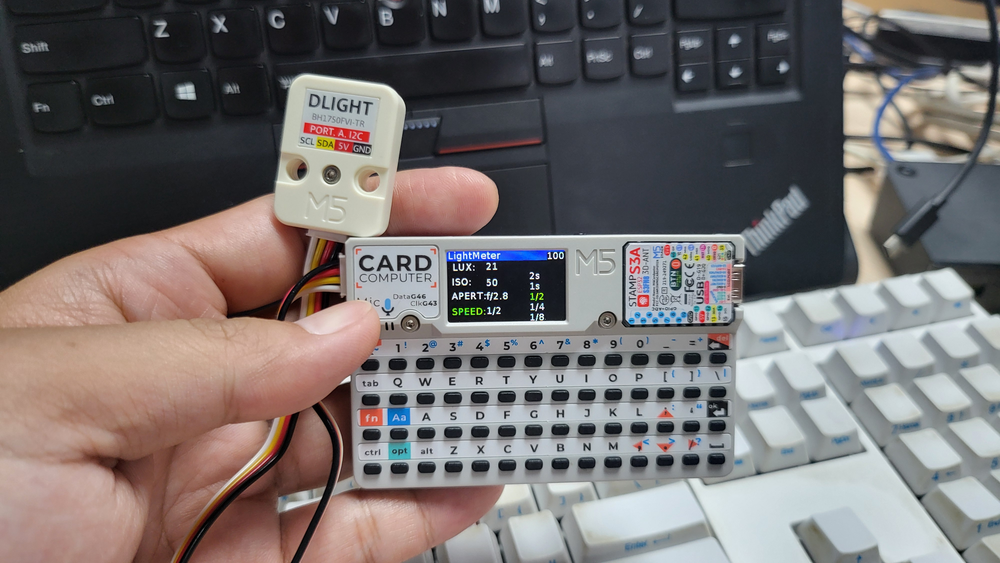

# Cardputer Photography Light Meter

[English](#english) | [中文](#中文)

---

## 📷 Cardputer Photography Light Meter (English)

A feature-rich photography light meter application for the M5Stack Cardputer, developed in MicroPython. It provides both Aperture Priority and Shutter Priority modes with a responsive and intuitive user interface.

 
<!-- TODO: Replace this with your own app screenshot -->

### Hardware Requirements

*   M5Stack Cardputer
*   M5Stack DLight Unit (I2C Ambient Light Sensor)

### Features

-   **Dual-Mode Metering**: Supports Aperture Priority (`A`) and Shutter Priority (`S`) modes to suit different shooting scenarios.
-   **Real-Time Calculation**: After adjusting any exposure parameter (ISO, Aperture, Shutter), the third parameter is calculated and updated instantly without any confirmation needed.
-   **Intuitive UI**:
    *   The left side clearly displays the final exposure combination of ISO, Aperture (`APERT`), and Shutter Speed (`SPEED`).
    *   The right side features a vertical selection list for the currently adjustable parameter, providing clear context.
    *   The currently focused parameter and the selected value in the list are highlighted in **green** for clear operational focus.
-   **Smart Boundary Detection**:
    *   When an option in the selection list would cause the calculated result to exceed the preset range (e.g., a shutter speed faster than 1/4000s), that option is marked in **red**.
    *   The application **prevents** the user from selecting red-marked invalid options, ensuring operations stay within a valid exposure range.
-   **Non-Circular Selection**: The parameter list stops scrolling when it reaches the maximum or minimum value, which is more precise and aligns with professional habits.
-   **Hardware Info**: Displays the real-time LUX value from the DLight sensor and the device's battery level.

### How to Use

#### Key Controls

-   **`i` / `a` / `s` keys**: Switch operational focus and metering mode.
    -   **`a` key**: Sets to **Aperture Priority** mode and moves focus to Aperture (`APERT`).
    -   **`s` key**: Sets to **Shutter Priority** mode and moves focus to Shutter Speed (`SPEED`).
    -   **`i` key**: Moves focus to ISO. This action **does not** change the current metering mode (A/S).
-   **`.` key (Up Arrow)**: Scrolls up and selects a value for the focused parameter.
-   **`;` key (Down Arrow)**: Scrolls down and selects a value for the focused parameter.

### Installation

This project is developed with MicroPython. You can use tools like `mpremote` to deploy the code to your Cardputer.

1.  Connect your Cardputer to your computer via USB.
2.  Open your terminal and run the following command to copy the main program file to the device:
    
